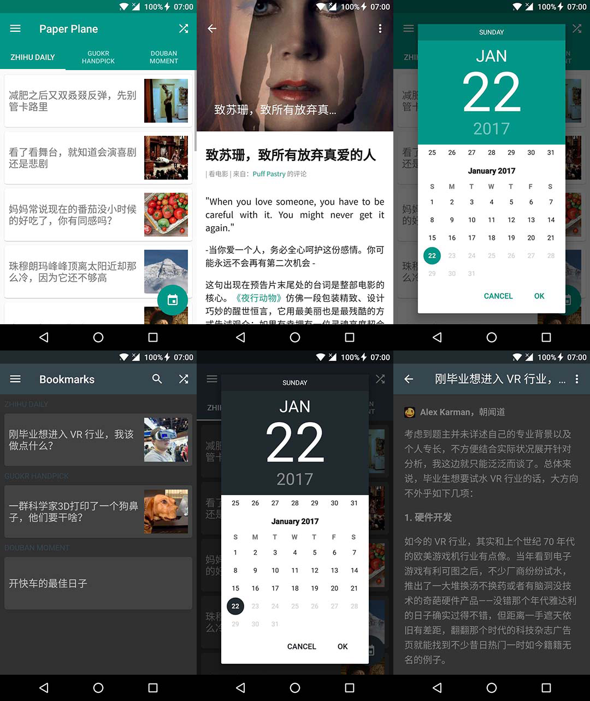

# Paper Plane

[](https://travis-ci.org/TonnyL/PaperPlane)

<div align="center">
	
</div>

English | [中文版](./README_CN.MD)

## Introduction

Paper Plane is a reading app based on Android platform which contains articles from Zhihu Daily, Guokr Handpick and Douban Moment.

API of ZhiHuDaily comes from repository [ZhihuDailyPurify](https://github.com/izzyleung/ZhihuDailyPurify)'s [wiki](https://github.com/izzyleung/ZhihuDailyPurify/wiki/%E7%9F%A5%E4%B9%8E%E6%97%A5%E6%8A%A5-API-%E5%88%86%E6%9E%90).

The architecture of this project is [Google Android Architecture Blueprints [beta]](https://github.com/googlesamples/android-architecture)'s todo-mvp.

## Screenshots


## Open the project in Android Studio
To open this project in Android Studio, begin by checking out of the branches, and then open the `PaperPlane/` dictionary in Android Studio. The following series of steps illustrate how to open the `PaperPlane` branch.

Clone the repository:
```
git clone https://github.com/marktony/PaperPlane.git
```

checkout the master branch:
```
git checkout master
```

Note: If you want to review a different branch, replace the `master` with the name you want to checkout like the `dev`.

Finally open the `PaperPlane/` directory in Android Studio.

## Download APK
* [](https://play.google.com/store/apps/details?id=com.marktony.zhihudaily)
* [Xiaomi Apps market](http://app.mi.com/detail/312703?ref=search)
* [Cool market](http://www.coolapk.com/apk/com.marktony.zhihudaily)
* Smartisan App Market
* [Google Drive](https://drive.google.com/open?id=0B3yYs4KaSVg_MnpfVVY1S0s0MVU)

## Related open source libraries
Name | Introduction
--------- | --------
[Android Support Libraries](https://developer.android.com/topic/libraries/support-library/index.html) | The Android Support Library offers a number of features that are not built into the framework. These libraries offer backward-compatible versions of new features, provide useful UI elements that are not included in the framework, and provide a range of utilities that apps can draw on.
[Glide](https://github.com/bumptech/glide) | An image loading and caching library for Android focused on smooth scrolling.
[Gson](https://github.com/google/gson) | A Java serialization/deserialization library that can convert Java Objects into JSON and back.
[MaterialDateTimePicker](https://github.com/wdullaer/MaterialDateTimePicker) | Pick a date or time on Android in style.
[Volley](https://android.googlesource.com/platform/frameworks/volley/) | Volley is an HTTP library that makes networking for Android apps easier and most importantly, faster. Volley is available through the open AOSP repository.

## License

    Copyright 2017 lizhaotailang

    Licensed under the Apache License, Version 2.0 (the "License");
    you may not use this file except in compliance with the License.
    You may obtain a copy of the License at

        http://www.apache.org/licenses/LICENSE-2.0

    Unless required by applicable law or agreed to in writing, software
    distributed under the License is distributed on an "AS IS" BASIS,
    WITHOUT WARRANTIES OR CONDITIONS OF ANY KIND, either express or implied.
    See the License for the specific language governing permissions and
    limitations under the License.
